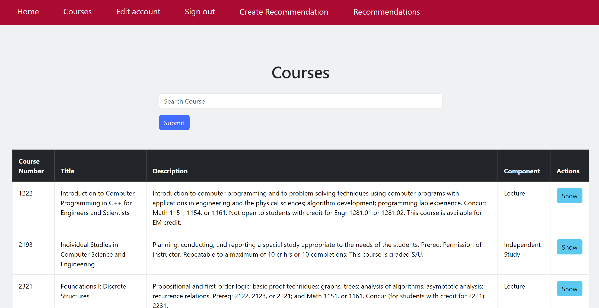

## Features/Capabilities of the App

This app provides an overview of all the CSE classes offered at OSU in a specific semester after a user logins with the account the made. **Accounts can only be made with an [name].[number]@osu.edu email**. There are 3 different account types: student, instructor, and admin. Account types can be selected upon registering, and student accounts will not need admin approval; *however, instructor and admin accounts will need to be approved by an admin in the admin dashboard*. 

With a student account, the user can view courses and their sections in a given semester. 

With an instructor account, the user can view courses and their sections in a given semester (in a future update, instructors will be able to post openings for TA positions in their section and view applicants in order to hire a TA). 

With an admin account, the user can view courses and their sections in a given semester. Additionally, they can add/edit/remove courses and sections as well as approve instructor and admin accounts. 



### Extra Functionalities

When viewing the course catalog, the user is able to search a course by title, course number, course level, and subject. This feature is an optional feature listed in the assignment that we chose to implement to make it easier for users to find their desired course.

***

## How to Install the App

This app requires Ruby 3.2.0 or newer versions. 
1. Clone the repo either through HTTPS or SSH
   - Through HTTPS: https://github.com/cse-3901-sharkey/2024-su-Team-3-Lab-3.git
   - Through SSH: git@github.com:cse-3901-sharkey/2024-su-Team-3-Lab-3.git
2. Run the following commands:
   ```
   bundle install
   bin/rails db:migrate
   ```
3. Open `localhost:3000` in your browser.
     
***
## How to Use the App

*Register an account*

1. Click on "Register" on the navigation bar.

2. Fill in the boxes with your relevent information.

2. Your account is now registered! You're already logged in and can view classes. But if you chose a role such as "instructor" or "admin", you will not have permissions of that role UNTIL an admin account approves your account.

*Log into your account*

1. Click on "Login" on the navigation bar.
 
2. Fill in the boxes with your account information.

3. You are now logged in and can view classes!
   
*View courses*

1. Click on "Courses" on the top left of the navigation bar.
 
2. You are now able to view all CSE classes offered at OSU!

3. If you want to view sections for a specific course, click on "view" on the right side of the page in the same line of the course. 

*Search courses*

1. Click on "Courses" on the top left of the navigation bar.
 
2. Type in what class you are searching for via the course title, course number, course level, and/or subject.

3. You found the course you're looking for! If you want to view sections for a specific course, click on "view" on the right side of the page in the same line of the course.

*Send an application to become a grader or edit a previously sent grader application*

1. Register or log into a student account.

2. Press "New Grader Application" or "Grader Application" to either fill out the form or view/edit a previously submitted form.

*Create recommendation*

1. Register or log into an instructor account and await approval from an admin user.

2. Press "Create Recommendation" or "Recommendations" to either fill out the form or view/edit a previously submitted form.

***FOR ADMINS***

*Login for Admin user:*
   - username: admin.1@osu.edu
   - password: team3pass

*Approve instructor and admin account requests*

*Remove student, instructor and admin accounts even after they have been approved*

*Load multiple new courses using API request*

*Edit courses individually*

*Delete courses individually and also delete ALL courses*


***

## Troubleshooting the App

*Problem: Running `bundle install` gives the error*

*"Bundler::PermissionError: There was an error while trying to create. It is likely that you need to grant executable permissions for all parent directories and write permissions* *for `$HOME/.rbenv/versions/3.2.0/lib..`".*

Solution: Restart your computer. Open your terminal and change into the directory of the project. Run the command `bundle install` and `gem pristine --all`

***

*Problem: Entering localhost:3000 into browser gives "This site can't be reached" error*

Solution: Ensure that the rails server has been started and if not do `bin/rails server` to start the server

***

*Problem: Opening website with localhost:3000 gives this error* 

*"Zeitwerk::NameError expected file /home/user/dir/app/helpers/sections_helper.rb to define constant SectionsHelper, but didn't"*

Solution: Refresh browser page.

***

*Problem: Opening website with localhost:3000 gives this error*

*"ActiveRecord::PendingMigrationError Migrations are pending. To resolve this issue, run: bin/rails db:migrate"*

Solution: run `bin/rails db:migrate`

***

*Problem: Opening website with localhost:3000 gives this error*

*"SQLException: table table_name already exists*

Solution: run `bin/rails destroy model table_name`

***

*Problem: When running `rails server`, receiving error message, "Could not find bootstrap-5.3.3, dartsass-sprockets-3.1.0..."*

Solution: run `bundle install --gemfile /[insert full dir path to the project]/Gemfile` to install missing gems.

**

*Problem: When running `rails server`, receiving error message, "Exiting /dir/...: Could not find table 'users' (ActiveRecord::StatementInvalid)"*

Solution: run `rails db:migrate`.

## Contributions

Shristi --  Worked on the application to become a grader feature with Bikash and improved CSS of log-in page

Ryan -- Worked on the recommendation submission feature with Ivy

Balaji -- Summarized project 3 instructions to remove any redudancies/generalities to make it clear what team's tasks were and assessed bugs from Project 2 that needed to be fixed to GitHub issues, handled clear and constant communication within teammates and also with grader to clarify any doubts on deadlines, specific feature requirements, implementation help, and debugging

Javan -- Worked on the new Admin Dashboard along with fixing previous issues of the Admin Dashboard from project 2, improved CSS by implementing Bootstrap, handled database migrations and all merge conflicts when merging all features to main, helped fix teammates implementation issues

Bikash -- Worked on the application to become a grader feature with Shristi 

Ivy -- Worked on the recommendation submission feature with Ryan

***

## Citations/Sources

Sources to help learn Ruby on Rails:
https://guides.rubyonrails.org/getting_started.html

Sources to help learn how to use ruby gems:
https://www.youtube.com/watch?v=9K5YvsrKBRk

Sources to help create CSS:
https://www.w3schools.com/css/
https://getbootstrap.com/docs/5.3/examples/
